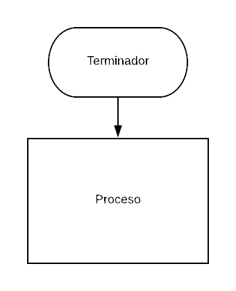

# SCOREKEEPER

### Descripcion:
magina que estás jugando un juego con algunas amigas y quieres ir registrando el puntaje de cada una. Crea un object llamado scores donde los keys o propiedades son los nombres de tus amigas, y los valores serán los puntajes (todos empiezan con 0).

Escribe una función que toma dos argumentos, el nombre de tu amiga y la cantidad de puntos nuevos que ha obtenido, y que actualice los puntos de la jugadora en el object scores. También escribe una función que imprima en la consola el total de los puntos.

## Pseudocodigo
### Descripcion
Se describe funcionalidad del proyecto

1. Definir el objeto *SCORES* en el cual se almacenara toda la data.

2. Crear los elementos JUGADORES que se almacenaran como *keys* en el objeto *SCORES*.

3. Agregar el puntaje de cada jugador.

4. Imprimir toda la data que se encuentra alamacenada en el objeto *SCORES*.

## Diagrama de Flujo
### Descripcion
aqui se agregara la descripcion del diagrama de Flujo

